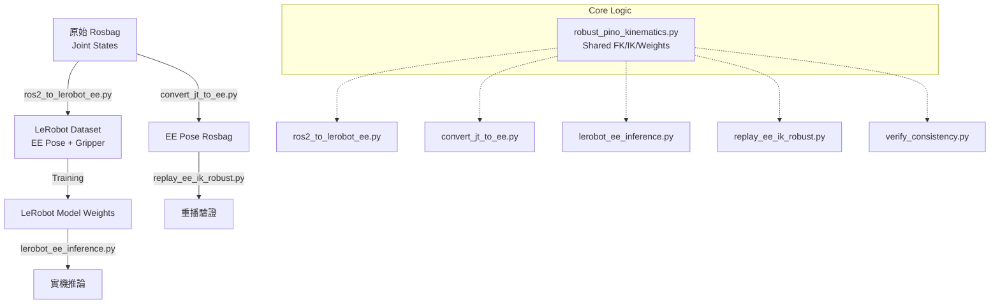

# End-Effector Control & Consistency System (Pinocchio-based)

本目錄包含一套完整的**「閉迴路一致性系統」**，能將機器人從 **Joint Space (關節空間)** 轉移到 **End-Effector Space (末端空間)** 進行訓練與執行。

這套系統解決了 5-DOF 機械臂在 Cartesian Control (笛卡爾空間控制) 中常見的**奇異點 (Singularity)**、**多解不穩定性**與**旋轉跳變**問題。

---

## 🚀 系統架構圖 (System Architecture)

這套系統由一個核心運算庫 (`robust_pino_kinematics.py`) 驅動，涵蓋了數據轉換、模型訓練到實機執行的完整流程。



---

## 📂 核心檔案詳解 (File Overview)

### 1. 🧠 核心運算庫: `robust_pino_kinematics.py`
這是整套系統的**心臟**。所有上層程式都**必須**呼叫它來進行 FK/IK 運算，確保數學模型的一致性。

*   **功能**:
    *   **FK (Forward Kinematics)**: 將關節角度 (Joints) 轉換為末端姿態 (Pose 7D: Pos + Quat)。
    *   **IK (Inverse Kinematics)**: 將末端姿態 (Pose) 解算回關節角度 (Joints)。
*   **關鍵邏輯 (Weighted DLS for 5-DOF)**:
    *   一般的 IK 會試圖同時滿足位置 (Position) 與旋轉 (Rotation) 誤差。
    *   但 5-DOF 手臂**無法**完美滿足任意 6D Pose。
    *   **解決方案**: 我們引入了 **權重矩陣 (Weighting Matrix)**。
        *   `pos_weight = 1.0`: 高度優先保證位置準確 (x, y, z)。
        *   `rot_weight = 0.05`: **大幅降低**旋轉誤差的權重。
        *   **效果**: 當旋轉無法滿足時，IK 會選擇「位置準確」但「旋轉有誤差」的解，而不會為了微小的旋轉差異讓手臂產生劇烈翻轉或抽搐。

### 2. 🔄 數據轉換 (Training Prep): `ros2_to_lerobot_ee.py`
這是訓練前**最重要**的步驟。它將原始錄製的 Rosbag (Joint States) 直接轉換為 LeRobot 可用的訓練格式。

*   **功能**: 讀取原始 Bag (Joints) -> FK 計算 EE Pose -> 輸出 LeRobot Dataset。
*   **配置檔**: `ros2_to_lerobot_ee_config.yaml`
*   **核心邏輯 (Quaternion Continuity)**:
    *   由於 $q$ 與 $-q$ 代表相同的旋轉，原始數據可能會在兩者間跳變 (Flip)。
    *   這會導致模型訓練失敗 (Loss 很高，動作抖動)。
    *   **解決方案**: 程式會檢查前後兩幀的 Quaternion **內積 (Dot Product)**。如果 `< 0`，自動翻轉符號，確保數據在流形 (Manifold) 上是平滑連續的。
*   **Gripper 處理**: 直接保留原始 Gripper 數值，附加在 Pose 向量後 (變成 8D: 7D Pose + 1D Gripper)。

### 3. 🤖 實機推論 (Inference): `lerobot_ee_inference.py`
這是讓訓練好的模型在真實機器人上運作的程式。

*   **功能**: 訂閱感測器 -> 模型預測 -> 控制機器人。
*   **核心流程 (Closed-Loop)**:
    1.  **State**: 讀取當前關節角度 (Joints)。
    2.  **FK**: 轉成當前末端姿態 (Current Pose)。
    3.  **Model**: 輸入 (Current Pose + Image) -> 預測 (Target Pose)。
    4.  **IK**: 將 (Target Pose) 解算為 (Target Joints)。這裡使用了 `robust_pino_kinematics` 的加權 IK，確保動作平滑。
    5.  **Control**: 發布控制指令。

### 4. 📊 數據分析 (Tools): `convert_jt_to_ee.py` & `verify_consistency.py`
這兩支程式用於開發階段的除錯與驗證。

*   `convert_jt_to_ee.py`: 單純把 Bag 轉成 Pose 格式的 Bag (用於分析，非訓練)。
*   `verify_consistency.py`: **一致性檢查工具**。
    *   它模擬一邊播放數據一邊解 IK 的過程。
    *   如果 **FK -> IK** 的誤差很大 (RMSE > 0.1 rad)，代表該動作對機器人來說太勉強，或者 IK 參數需要調整。
    *   **Warm Start**: 它驗證時會使用「上一幀的解」作為初始猜測，這才是模擬真實連續運動的正確方式。

### 5. 🎬 重播驗證 (Tools): `replay_ee_ik_robust.py`
不經過神經網路，直接讀取 Pose 數據並用 IK 驅動機器人。

*   **用途**: 用來區分「是模型沒練好」還是「IK 解不出來」。
*   如果你發現 `inference` 動得怪，但 `replay` 動得很順，那就是**模型 (Model)** 的問題。
*   如果你發現 `replay` 就已經動得亂七八糟，那就是**運動學 (Kinematics/IK)** 的問題。

### 6. LeRobot 訓練資料轉換 (Dataset Conversion): `ros2_to_lerobot_ee.py`
這是將 ROS2 Bag 轉換為 LeRobot 訓練格式的關鍵步驟。

*   **功能**: 讀取原始 Bag (Joints) -> FK 計算 EE Pose -> 輸出 LeRobot Dataset。
*   **特性**: 自動處理 Quaternion 連續性 (避免 Flip) 與歸一化。
*   **用法**:
    ```bash
    python3 scripts/end-effector/ros2_to_lerobot_ee.py --config scripts/end-effector/ros2_to_lerobot_ee_config.yaml
    ```

### 7. 資料品質檢查 (Quality Check): `check_quaternions.py`
訓練前**必須**執行的檢查工具。

*   **功能**: 讀取轉換後的 LeRobot Dataset，畫出四元數曲線，檢查是否有垂直跳變 (Jumps)。
*   **判斷標準**:
    *   **Pass**: 顯示 `[OK] Left/Right Arm quaternions look continuous`。
    *   **Fail**: 顯示 `[WARNING] ... potential quaternion flips`，圖中有垂直切線。
*   **用法**:
    ```bash
    python3 scripts/end-effector/check_quaternions.py \
      --repo_id [Dataset_ID] \
      --root [Dataset_Root_Path]
    ```

### 8. 實機推論 (Inference): `lerobot_ee_inference.py`
執行訓練後的模型。

*   **功能**: 載入 ACT 模型 -> 閉迴路控制 (Joint -> FK -> Model -> IK -> Joint)。
*   **用法**:
    ```bash
    python3 scripts/end-effector/lerobot_ee_inference.py
    ```
    *(需修改程式內的 CHECKPOINT_PATH 指向你的模型)*

---

## 🛠️ 標準工作流程 (Pipeline)


0. 

  ```
  source /opt/ros/humble/setup.bash && source ros2_ws/install/setup.bash && xacro ros2_ws/src/koch_simulation/urdf/low_cost_robot.xacro prefix:=left_ > /tmp/koch_left.urdf && xacro ros2_ws/src/koch_simulation/urdf/low_cost_robot.xacro prefix:=right_ > /tmp/koch_right.urdf
  ```
1.  **數據轉換**: 將原始數據轉為一致的 EE 格式。
    ```bash
    python3 scripts/end-effector/convert_jt_to_ee.py Dataset/bags/original Dataset/converted_ee
    ```

    ```
    python3 scripts/end-effector/convert_jt_to_ee.py Dataset/bags/0303_clearwater_yellowtable/0001 tmp/0303_clearwater_yellowtable/0001
    ```

2.  **一致性檢查**: 確認轉換後的數據在數學上是可逆的。
    ```bash
    python3 scripts/end-effector/verify_consistency.py Dataset/converted_ee
    ```

    ```bash
    python3 scripts/end-effector/verify_consistency.py tmp/0303_clearwater_yellowtable/0001
    ```

3.  **實機/模擬重播**: 執行動作還原。
    ```bash
    python3 scripts/end-effector/replay_ee_ik_robust.py Dataset/converted_ee
    ```

    ```bash
    python3 scripts/end-effector/replay_ee_ik_robust.py tmp/0303_clearwater_yellowtable/0001
    ```

---

## ⚠️ 常見問題
- **ImportError: pinocchio**: 請確認已安裝 `pin` 套件 (`pip install pin`) 且 PYTHONPATH 包含 `cmeel` 路徑。
- **URDF 錯誤**: 確保 `/tmp/koch_left.urdf` 和 `/tmp/koch_right.urdf` 存在 (由 `start_fusion_system.sh` 或相關 launch 檔生成)。
